# Architecture Documentation

**Version:** 1.0
**Last Updated:** November 28, 2025

Visual architecture documentation for the dev-environment-template using Mermaid diagrams.

---

## Table of Contents

- [System Overview](#system-overview)
- [RAG Archetype Architecture](#rag-archetype-architecture)
- [API-Service Archetype Architecture](#api-service-archetype-architecture)
- [Frontend Archetype Architecture](#frontend-archetype-architecture)
- [Network Architecture](#network-architecture)
- [Data Flow Diagrams](#data-flow-diagrams)
- [Deployment Architecture](#deployment-architecture)

---

## System Overview

### High-Level Architecture

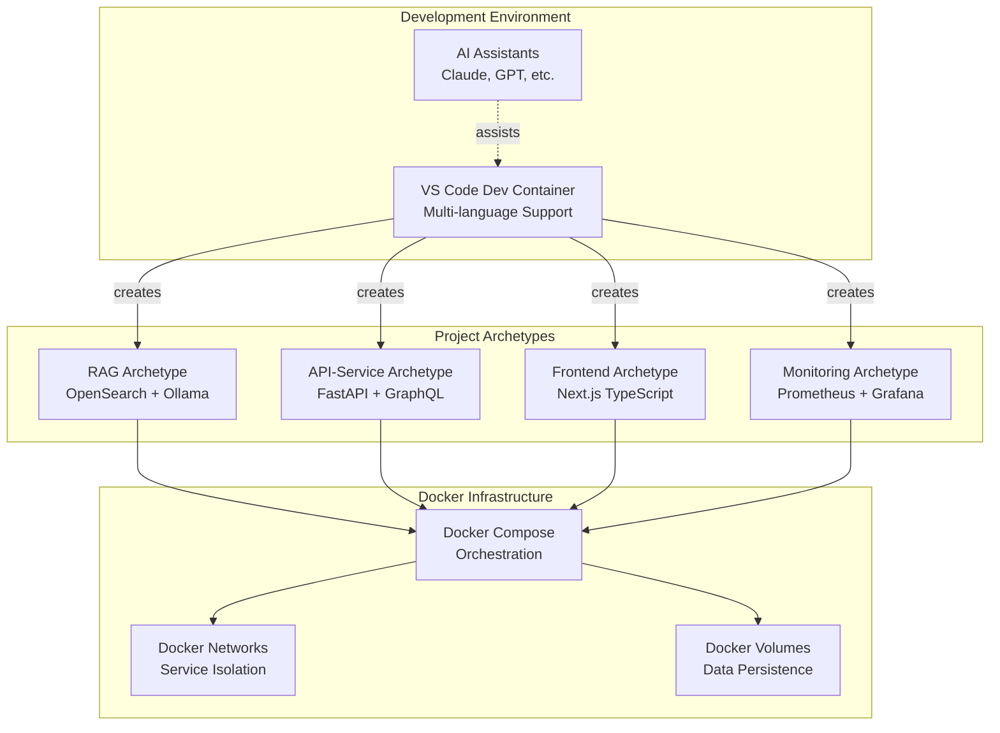

### Component Interaction

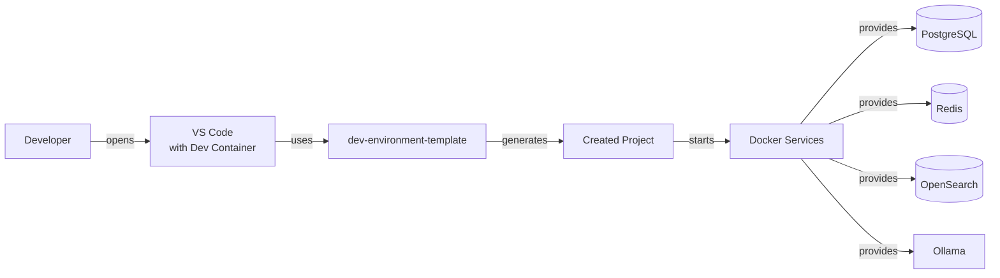

---

## RAG Archetype Architecture

### Service Architecture

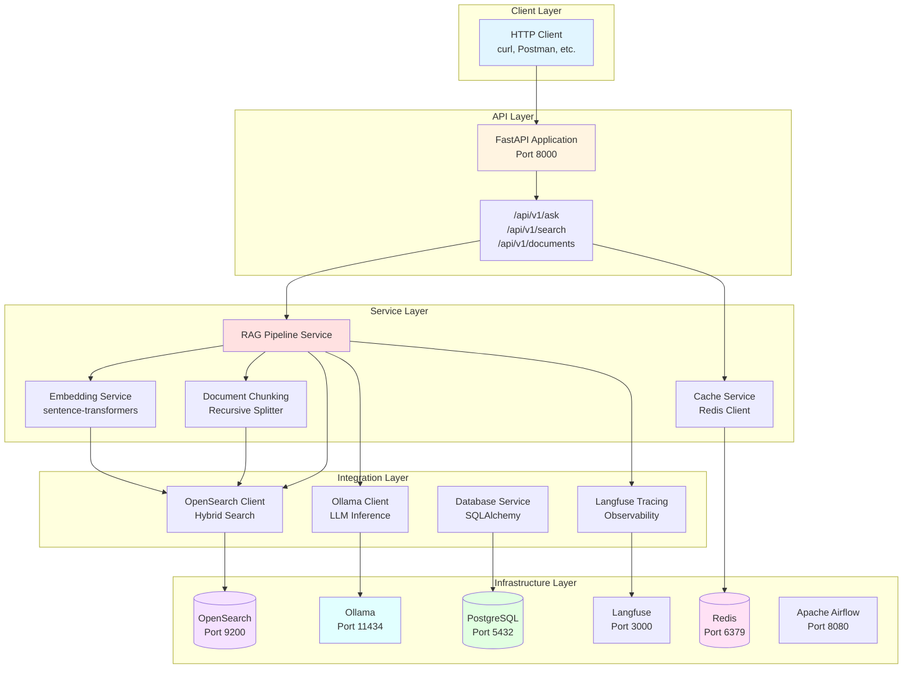

### RAG Query Flow

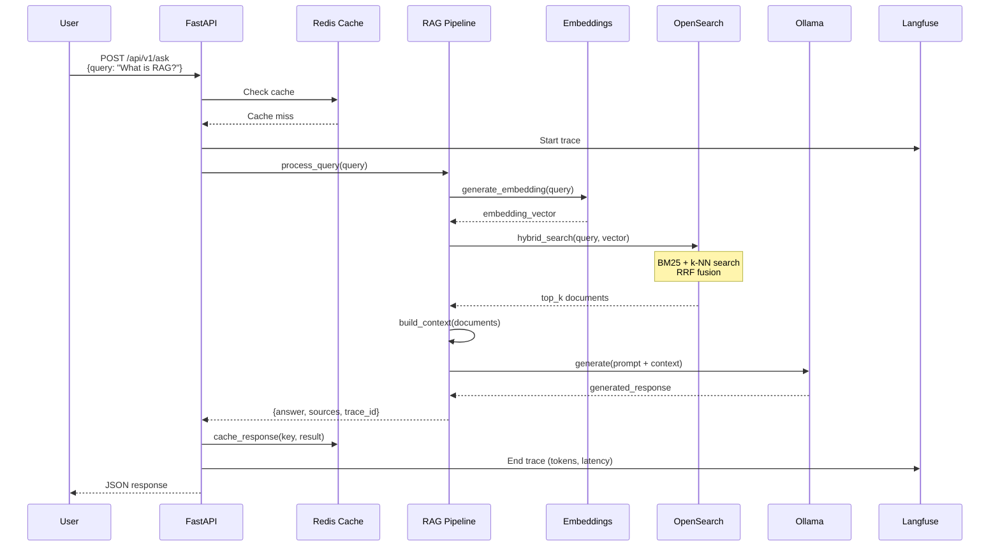

### Document Ingestion Flow (Airflow)

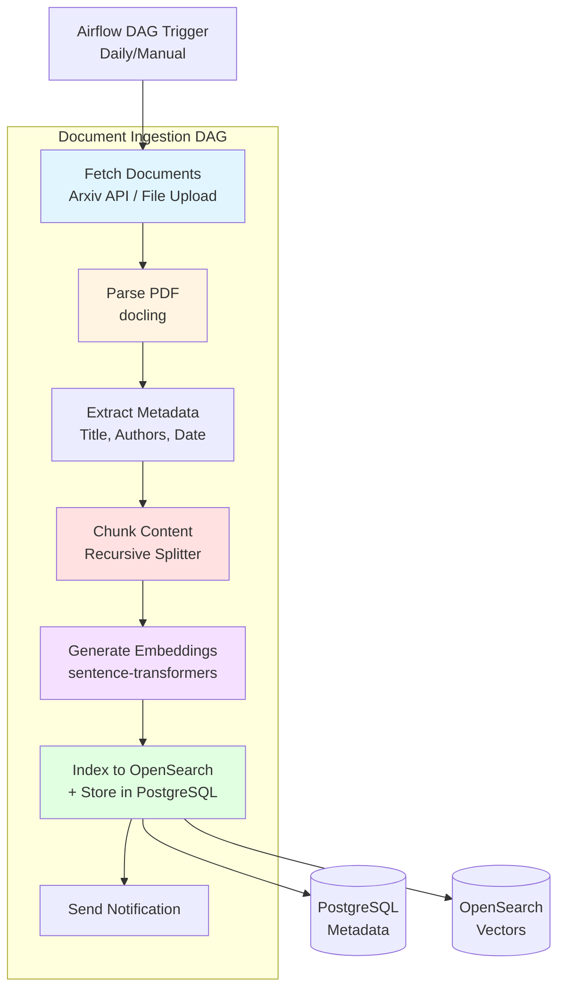

---

## API-Service Archetype Architecture

### Microservice Architecture

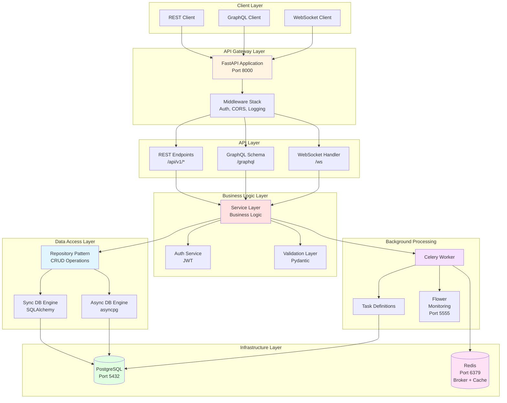

### GraphQL Request Flow

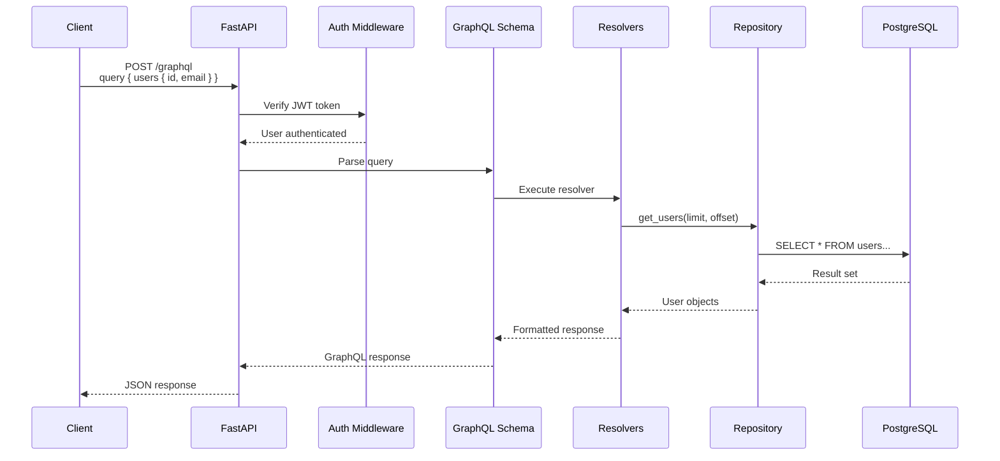

### Celery Background Task Flow

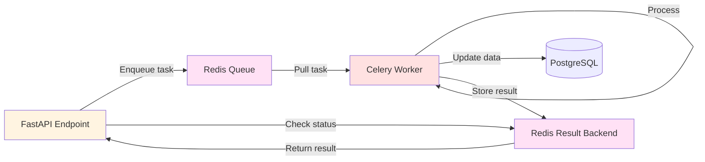

---

## Frontend Archetype Architecture

### Next.js Application Architecture

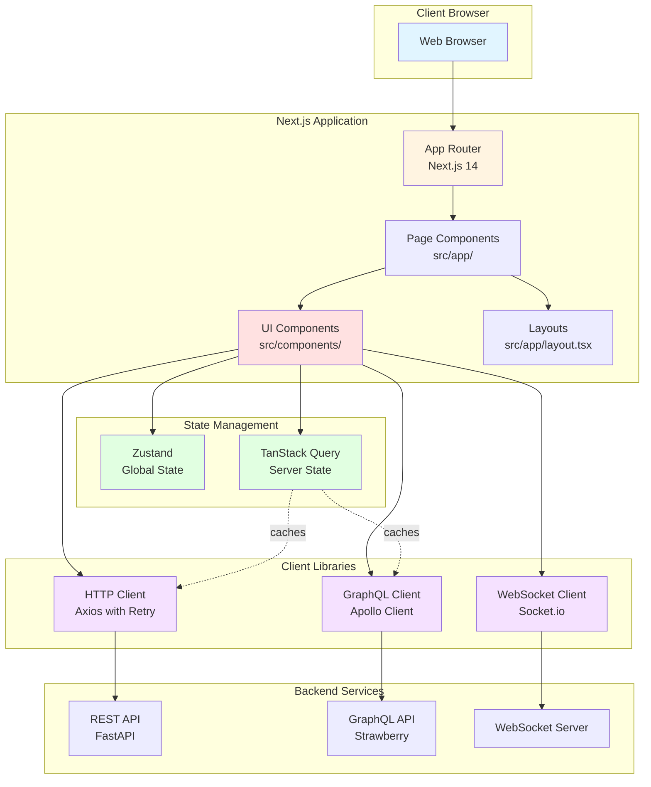

### Frontend Data Flow

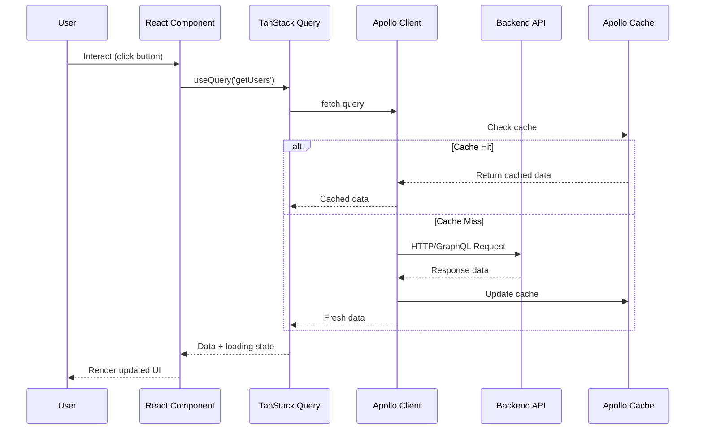

---

## Network Architecture

### Docker Network Topology

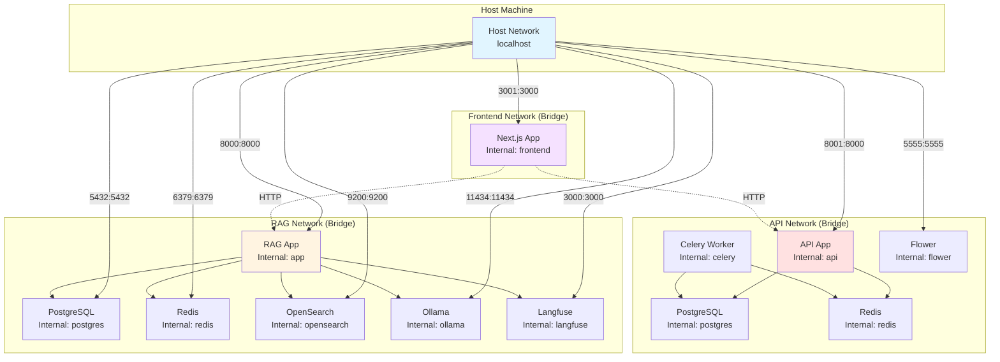

---

## Data Flow Diagrams

### RAG Data Flow

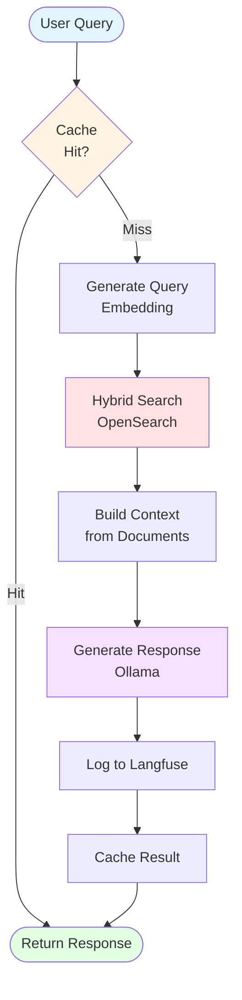

### API Request Flow

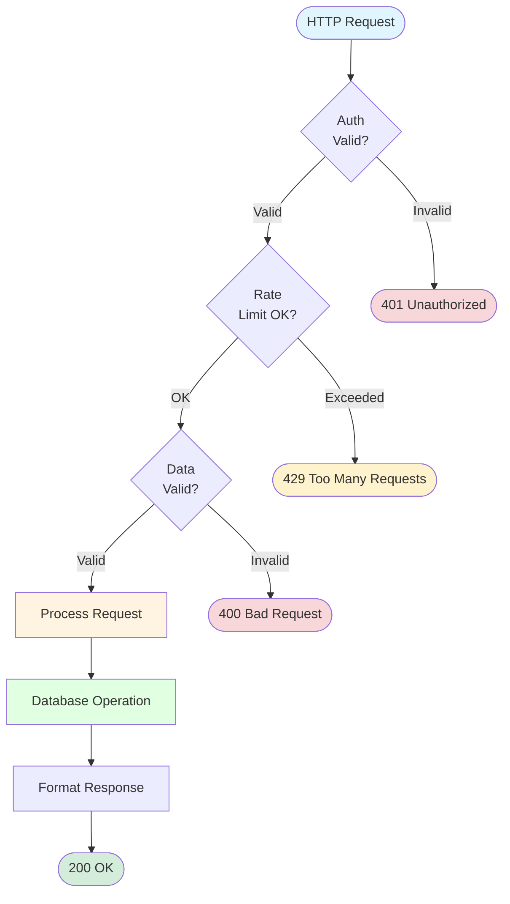

---

## Deployment Architecture

### Development Environment

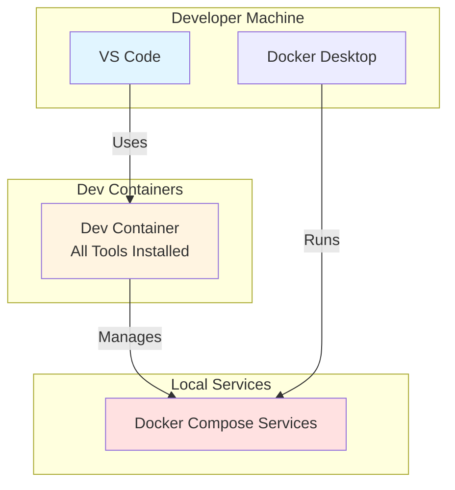

### Production Deployment (Example: Kubernetes)

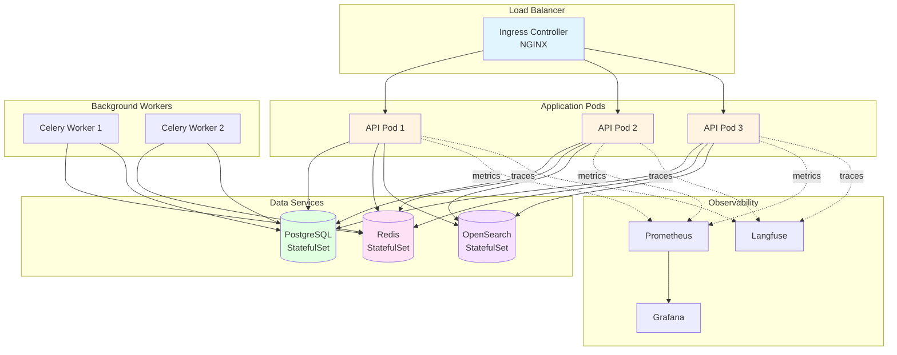

---

## Component Diagrams

### Database Schema Relationships (RAG)

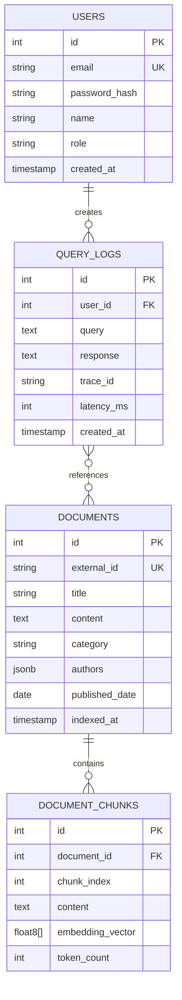

---

## Next Steps

- **[Technical Reference](TECHNICAL_REFERENCE.md)** - Detailed service specifications
- **[Usage Guide](USAGE_GUIDE.md)** - How to use the architecture
- **[Deployment Guide](DEPLOYMENT_GUIDE.md)** - Production deployment (coming soon)

---

**Last Updated:** November 28, 2025
**Version:** 1.0
